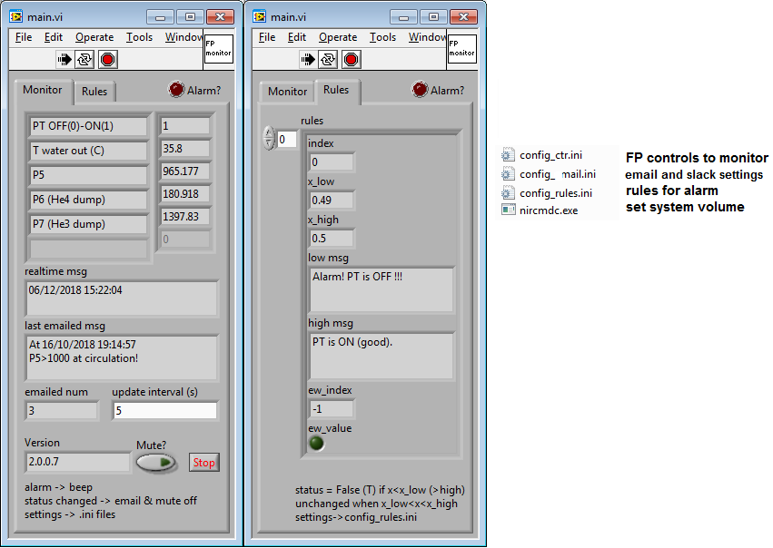

# FP-monitor
LabVIEW front panel monitor. I use it to get emails and beeps by monitoring Leiden's program.

## How it works
### Snapshots


### config_ctr.ini
Each control on the front panel of a LabWIEW program can be accessed by a 'Path' as follows:
```
[PT OFF(0)-ON(1)]
PATH=VI,127.0.0.1:3375,FP.vi/PNL_CTR,3/TAB_PAGE,0/PAGE_CTR,10/TAB_PAGE,1/PAGE_CTR,0
```
Here we name the reading as `PT OFF(0)-ON(1)`. `VI,127.0.0.1:3375,FP.vi` refers to the FP.vi of the Leiden program. Each LabVIEW excutable has a tcp server by default to talk with other programs. `PNL_CTR,3` gets a control from the Panel with index 3. It is a tab control in our case. `TAB_PAGE,0` returns the 0th page of a tab control...

`T water out (C)` is a bit different. The reading is inside a cluster control. We can not get the reading even after we get a reference to the cluster. To sovle this, we can add `VALUE=CLUSTER,2` as shown bellow, which means the value indexed by 2. 
```
[T water out (C)]
PATH=VI,127.0.0.1:3375,FP.vi/PNL_CTR,3/TAB_PAGE,0/PAGE_CTR,10/TAB_PAGE,1/PAGE_CTR,4
VALUE=CLUSTER,2
```

### config_email.ini and config_rules.ini
Just open the files. It's easy to understand.

## Block diagram of main.vi


